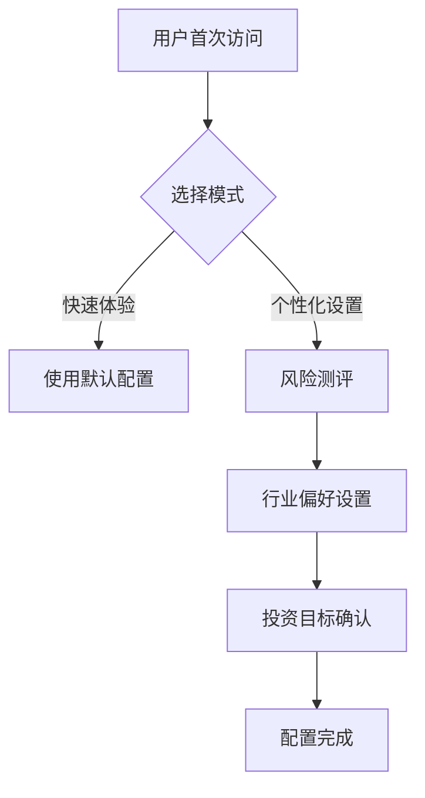

# 股票智能投资助手需求文档（完整版）

## 一、产品概述

**核心定位**：纯对话驱动的股票投资辅助工具  
**目标用户**：中国个人散户投资者  
**核心特色**：

- 100%对话交互（无传统 UI 控件）
- 智能流程引导
- 风险匹配机制

## 二、核心交互流程

### 1. 新用户引导流程



### 2.技术栈要求

- **框架**: Vue 3 + JavaScript
- **UI 库**: Element Plus (含中文语言包)
- **状态管理**: Pinia
- **HTTP 客户端**: axios
- **Mock 数据**: MockJS

# InvestAI

这是一个智能投资助手应用，基于Vue.js构建，支持股票查询、AI分析、交易功能等。

## 主要功能

- 智能股票推荐
- 个股查询与分析
- AI委托交易
- 用户画像设置
- 投资记录管理

## 个股查询检测工具使用说明

### 概述
`stockQueryDetector.js` 是一个用于识别用户输入是否为个股查询的智能检测工具。现已完全集成 `validateStockApi` 接口进行准确判断。

### 主要特性
- **API驱动**：主要依赖后端 `validateStockApi` 接口进行准确判断
- **智能排除**：自动排除大盘指数、投资咨询等非个股查询
- **本地后备**：API失败时提供本地检测作为后备方案
- **信息提取**：自动提取股票代码和名称

### 使用方法

```javascript
import { detectStockQuery, testStockQuery } from '@/utils/stockQueryDetector.js';

// 基本使用
async function checkUserInput(userMessage) {
  const result = await detectStockQuery(userMessage);
  
  if (result.isStockQuery) {
    console.log('用户询问个股:', result.stockInfo);
    console.log('置信度:', result.confidence);
  } else {
    console.log('非个股查询:', result.reason);
  }
}

// 测试函数
async function runTest() {
  await testStockQuery("中国平安"); // 测试个股查询
}
```

### API接口
检测工具调用的后端接口：
- **接口**: `GET /stock/validate`
- **参数**: `{ keyword: "用户输入的消息" }`
- **返回**: `{ data: true/false }` - true表示是个股查询

### 返回结果格式
```javascript
{
  isStockQuery: boolean,      // 是否为个股查询
  confidence: number,         // 置信度 (0-100)
  stockInfo: {               // 提取的股票信息
    codes: ['000001'],       // 股票代码数组
    names: ['平安银行'],      // 股票名称数组
    type: 'extracted'        // 信息类型
  },
  queryType: string,         // 查询类型 (api_validated/local_detection)
  reason: string,            // 判断原因
  message: string            // 原始消息
}
```

### 检测逻辑
1. **优先排除**：大盘指数、投资咨询相关查询
2. **API验证**：调用 `validateStockApi` 进行准确判断
3. **本地后备**：API失败时使用简单的本地检测
4. **信息提取**：从消息中提取股票代码和名称

### 示例用法
```javascript
// 个股查询示例
await detectStockQuery("中国平安");           // ✅ 个股查询
await detectStockQuery("000001");            // ✅ 个股查询  
await detectStockQuery("平安银行(000001)");   // ✅ 个股查询

// 非个股查询示例
await detectStockQuery("上证指数");           // ❌ 大盘指数
await detectStockQuery("投资组合建议");        // ❌ 投资咨询
await detectStockQuery("推荐股票");           // ❌ 通用推荐
```
