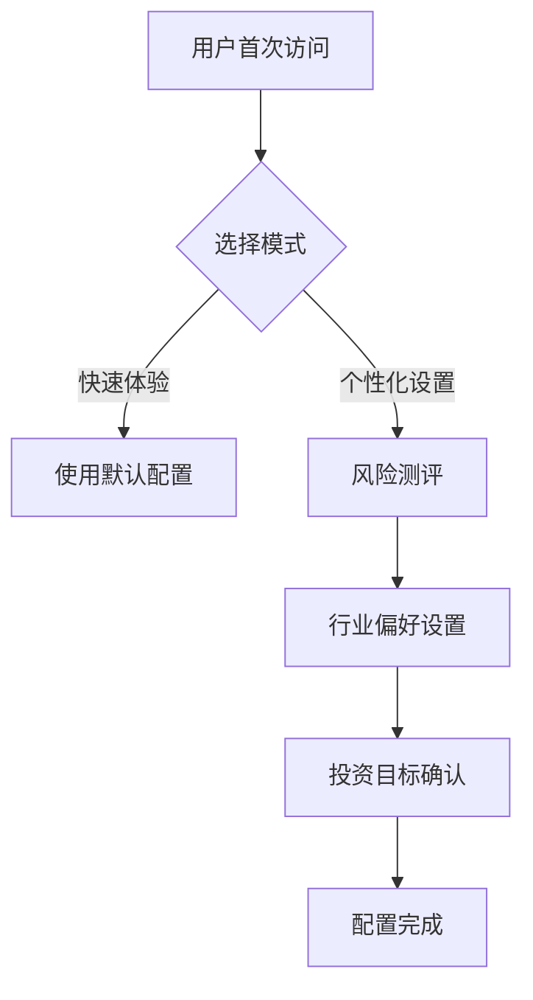

# 股票智能投资助手需求文档（完整版）

## 一、产品概述

**核心定位**：纯对话驱动的股票投资辅助工具  
**目标用户**：中国个人散户投资者  
**核心特色**：

- 100%对话交互（无传统 UI 控件）
- 智能流程引导
- 风险匹配机制

## 二、核心交互流程

### 1. 新用户引导流程

### 2.技术栈要求

- **框架**: Vue 3 + JavaScript
- **UI 库**: Element Plus (含中文语言包)
- **状态管理**: Pinia
- **HTTP 客户端**: axios
- **Mock 数据**: MockJS
